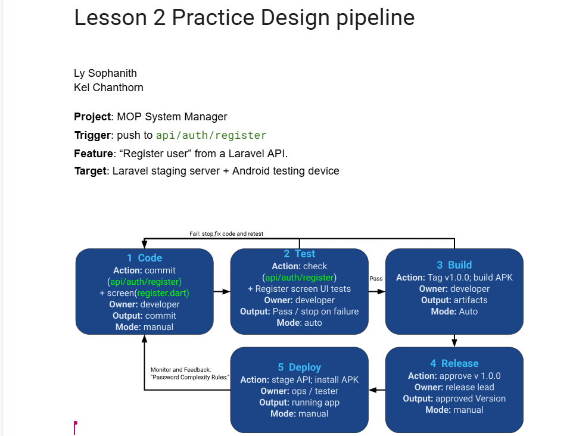

# DevOps Conception Class
- Student: [Kel Chanthorn]

## Lesson 2: Practice Design pipeline
- Project: [MOP System Manager]
- Trigger: [push to api/auth/register]
- Target: [Laravel stagig server+Android testing device]

### Pipeline design
Code -> Test -> Build -> Release -> Deploy
1. Code: [commit API ] | [developer] | [cmmit] | [manual]
2. Test: [check API] | [developer] | [pass/stop on failure] | [auto]
3. Build: [build APK] | [developer] | [artifacts] | [auto]
4. Release: [approv v 1.0.0] | [elease lead] | [approved version] | [manual]
5. Deploy: [stage API; install APK] | [ops/tester] | [running app] | [manual]
### Controls
On test/build failure: ... | Release approval by: ...
After deployment, check: ... | If it fails: ...
Feedback for the next change: password Complexly rules
Optional drawing: 
